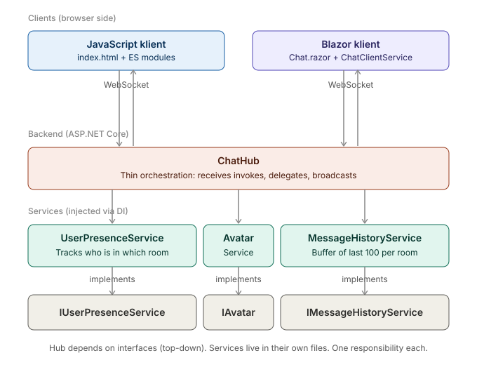

# 📣 ChatHub

Real-time chat-applikation bygget på **SignalR** med både en **JavaScript-klient** og en **Blazor Server-klient**, der deler samme backend hub. Discord-inspireret dark UI med avatars, emoji picker, typing indicator, private beskeder, chat-rooms og live online count.

Bygget som en del af UCL Datamatiker, Uge 19 — Synkrone opgaver / SignalR.

---

## 🏗️ Arkitektur — Big Picture



Diagrammet viser hvordan komponenterne hænger sammen — bemærk specielt at pilene mellem hub, interfaces og services begge peger **ind mod interfacet**. Det er essensen af Dependency Inversion.

### De 4 lag

- **Tier 1 — Klienterne** (blå/lilla): To forskellige UI'er, samme job. JS-klienten er ren HTML/JS, Blazor-klienten er C# der renderes via SignalR-circuit.
- **Tier 2 — ChatHub** (rød): Det centrale orkestreringspunkt. Modtager `invoke`-kald fra klienterne og delegerer videre. Jeg har bevidst holdt den tynd — ingen forretningslogik her.
- **Tier 3 — Interfaces** (grå): Kontrakter der definerer *hvad* services kan, ikke *hvordan*. Hub'en kender kun til disse.
- **Tier 4 — Services** (grøn): De konkrete implementations med faktisk logik.
- **DI Container** (gul): Bindeleddet. Ved app-start mapper den hvert interface til sin konkrete klasse.

### WebSocket — den vedvarende forbindelse

Når en bruger logger ind, åbnes en **vedvarende forbindelse** mellem browser og server (begge veje). Begge parter kan sende beskeder når som helst — ingen polling, ingen overhead ved gentagne HTTP-requests.

### Dependency Inversion i praksis

Pilene i diagrammet viser hvordan afhængighederne peger:

```
ChatHub  →  Interface  ←  Service
```

Begge peger ind mod interfacet. Det betyder:

- Hub'en (high-level) afhænger af **abstraktion**
- Service'en (low-level) afhænger også af **abstraktion**
- Begge kender kun til interfacet — ikke til hinanden

I koden ser det sådan ud:

**1. Interface — kontrakten:**
```csharp
// Interfaces/IUserPresenceService.cs
public interface IUserPresenceService
{
    void AddUser(ConnectedUser user);
    ConnectedUser? GetUser(string connectionId);
    // ...
}
```

**2. Hub — afhænger kun af interfacet:**
```csharp
// Hubs/ChatHub.cs
public ChatHub(IUserPresenceService presence, ...)  // ← interface
{
    _presence = presence;
}
```

**3. Service — implementerer interfacet:**
```csharp
// Services/UserPresenceService.cs
public class UserPresenceService : IUserPresenceService  // ← implementer
{
    // konkret kode med ConcurrentDictionary
}
```

**4. DI Container — binder dem sammen ved runtime:**
```csharp
// Extensions/ServiceCollectionExtensions.cs
services.AddSingleton<IUserPresenceService, UserPresenceService>();
//                    ↑ interface           ↑ konkret implementation
```

Det betyder `UserPresenceService` kan udskiftes med en Redis-version eller EF Core-version uden at ændre én linje i `ChatHub`. Det er **Dependency Inversion** (D'et i SOLID).

### Hvad sker der når man sender en besked?

1. Bruger trykker **Enter** i input-feltet
2. JS-klienten kalder `connection.invoke("SendMessage", "hej")` → pakkes til en WebSocket-frame
3. Frame'en lander i `ChatHub.SendMessage()` på serveren
4. Hub'en spørger `IUserPresenceService` om hvem afsenderen er og hvilket rum han er i
5. Hub'en spørger `IMessageHistoryService` om at gemme beskeden
6. Hub'en broadcaster til alle i rummet via `Clients.Group(room).SendAsync("ReceiveMessage", message)`
7. Alle klienter i rummet får frame'en og deres `connection.on("ReceiveMessage", ...)` handler kører
8. `uiRenderer.js` bygger et nyt DOM-element og scroller til bunden

Hele rejsen tager typisk under 50ms — det føles instant. ⚡

---

## 📂 Mappestruktur

```
SignalRChat/
├── SignalRChat.sln
└── src/
    ├── SignalRChat.Server/              # SignalR backend + JS-klient
    │   ├── Models/                      # ChatMessage, ConnectedUser (records)
    │   ├── Interfaces/                  # IUserPresenceService, IAvatarService, IMessageHistoryService
    │   ├── Services/                    # Konkrete implementations (DI'd into hub)
    │   ├── Hubs/ChatHub.cs              # Tynd orkestrering — delegerer til services
    │   ├── Extensions/                  # AddChatServices() — holder Program.cs ren
    │   ├── Program.cs                   # 20 linjer, ingen forretningslogik
    │   └── wwwroot/
    │       ├── index.html               # Ren markup, ingen inline JS/CSS
    │       ├── css/                     # 5 filer, hver med sit eget ansvar
    │       │   ├── reset.css
    │       │   ├── variables.css        # Design tokens
    │       │   ├── layout.css           # Grid / shell
    │       │   ├── components.css       # Genbrugelige UI-komponenter
    │       │   └── animations.css       # Kun @keyframes
    │       └── js/                      # ES modules
    │           ├── app.js               # Composition root — binder det hele sammen
    │           ├── chatConnection.js    # SignalR wrapper
    │           ├── uiRenderer.js        # DOM rendering
    │           └── avatarService.js     # Avatar URL generation
    │
    └── SignalRChat.Blazor/              # Blazor Server-klient (bruger samme hub)
        ├── Models/                      # DTOs der matcher server contracts
        ├── Services/
        │   ├── IChatClientService.cs    # Abstraktion
        │   └── ChatClientService.cs     # SignalR client wrapper
        ├── Components/
        │   ├── App.razor
        │   ├── Routes.razor
        │   └── Pages/Chat.razor         # Hoved-UI (bruger IChatClientService)
        └── wwwroot/css/app.css          # Samme designsprog som JS-klienten
```

---

## 🎯 SOLID-principper i denne kodebase

- **S — Single Responsibility**: Hub'en orkestrerer; `UserPresenceService` tracker tilstedeværelse; `AvatarService` genererer avatars; `MessageHistoryService` gemmer historik. Ingen klasse gør to ting.
- **O — Open/Closed**: Vil man tilføje persistens af beskeder? Implementér `IMessageHistoryService` med EF Core og swap registreringen i `ServiceCollectionExtensions` — ingen kode i hub'en ændres.
- **L — Liskov Substitution**: Alle services bruges udelukkende via deres interface. En mock i tests fungerer 1:1.
- **I — Interface Segregation**: Tre små, fokuserede interfaces frem for ét stort `IChatService`-monstrum.
- **D — Dependency Inversion**: Hub'en kender kun til abstraktioner (`IUserPresenceService` osv.), ikke konkrete typer. DI-containeren binder dem sammen.

### Separation of Concerns (frontend)

JavaScript-klienten følger samme princip:

- `chatConnection.js` ved alt om SignalR — intet om DOM
- `uiRenderer.js` ved alt om DOM — intet om SignalR
- `app.js` er composition root: lytter på events fra connection, kalder renderer
- CSS er splittet: `variables.css` har designsystemet, `layout.css` har struktur, `components.css` har UI, `animations.css` har keyframes

Det betyder SignalR kan udskiftes med raw WebSocket uden at røre `uiRenderer.js`, eller hele UI'en kan skiftes ud uden at røre `chatConnection.js`.

---

## 🚀 Sådan kører du det

Kræver **.NET 8 SDK** installeret.

### Backend + JS-klient (én terminal)

```bash
cd src/SignalRChat.Server
dotnet run
```

Åbn **http://localhost:5050** i to browserfaner og chat med dig selv.

### Blazor-klienten (anden terminal — backend skal stadig køre)

```bash
cd src/SignalRChat.Blazor
dotnet run
```

Åbn **http://localhost:5051** — Blazor-klienten forbinder til samme hub på port 5050. JS-klienten og Blazor-klienten kan være åbne samtidig — de chatter sammen.

---

## ✨ Features

| Feature | JS-klient | Blazor-klient |
|---|---|---|
| Realtime chat | ✅ | ✅ |
| Chat-rooms / channels | ✅ | ✅ |
| Private beskeder (klik på bruger) | ✅ | ✅ |
| Typing indicator | ✅ | ⏳ (kun receiver) |
| Online users per room | ✅ | ✅ |
| Global online count | ✅ | ✅ |
| Auto-reconnect | ✅ | ✅ |
| Message history ved join | ✅ | ✅ |
| Unique avatars per username | ✅ | ✅ |
| Emoji picker | ✅ | ⏳ |
| Toast notifications (join/leave) | ✅ | ✅ |

---

## 🔧 Tekniske valg

- **.NET 8** — LTS-version
- **Avatars**: DiceBear API (gratis, ingen nøgle, deterministisk: samme username = samme avatar)
- **Fonts**: Space Grotesk (display + body) + JetBrains Mono (mono) fra Google Fonts
- **State**: In-memory (`ConcurrentDictionary`). Til produktion: swap `IUserPresenceService` til Redis eller backplane.
- **Messages**: Rolling buffer på 100 per room. Ingen DB.

---

## 🧪 Sådan kan det udvides

**Tilføj persistens af beskeder med EF Core:**
1. Opret `EfMessageHistoryService : IMessageHistoryService`
2. I `ServiceCollectionExtensions.cs`: skift `AddSingleton<IMessageHistoryService, MessageHistoryService>` til den nye implementation
3. Færdig. Hub'en og klienterne ændres ikke.

**Tilføj authentication:**
1. Tilføj ASP.NET Core Identity
2. Sæt `[Authorize]` på `ChatHub`
3. Brug `Context.User?.Identity?.Name` i stedet for selvvalgt username

---

Built with 📣 by [@codemikemike](https://github.com/codemikemike)
